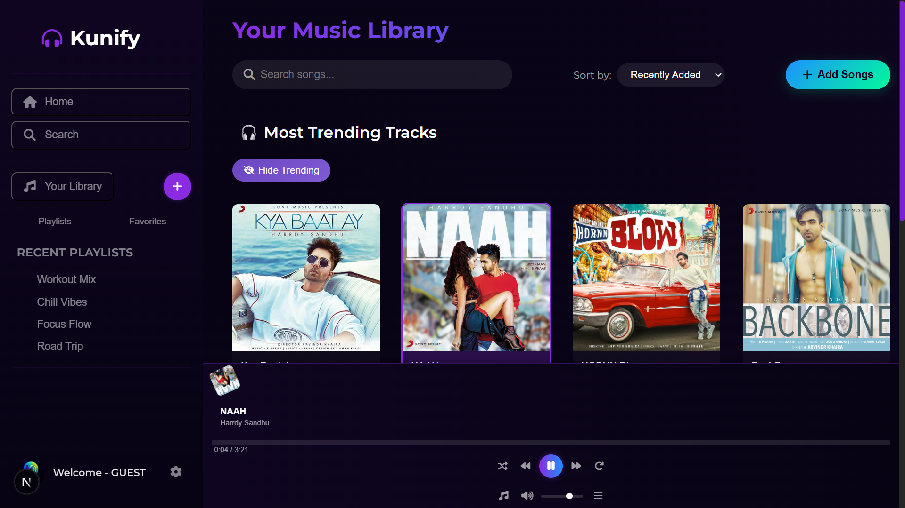
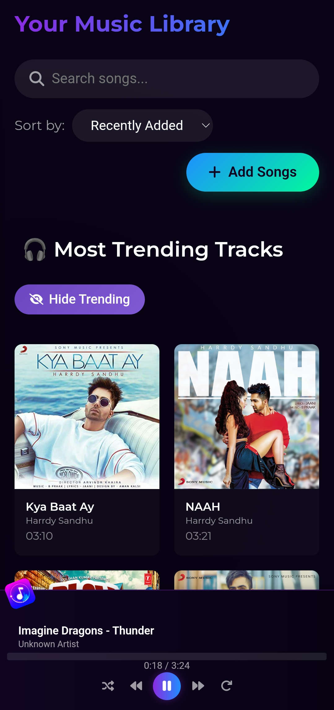

# 🎵 Kunify - The Modern Web Music Player

**Kunify** is a modern, feature-rich, and responsive music streaming web app built with **Next.js App Router** and **Supabase**.  
Inspired by platforms like Spotify, Kunify enables users to **upload**, **manage**, and **stream audio** directly from the browser — all in a sleek, minimalist interface.

---

## 📷 Screenshots

 **Web Player**

 

 ---

 (public/Preview2.png)
 
  **Mobile View**
  
 

---

### 🎧 When you're debugging audio errors at 2 AM...
> *"The file is there. The path is correct. The code is clean. So why the hell isn't it playing?!"*

---

## ✨ Features

- 🎧 **Audio Playback** — Seamless song playback with controls for play, pause, seek, volume, and repeat.
- 📤 **Audio Uploads** — Supports uploading MP3, WAV, M4A, OGG, and AAC with size/type validations.
- 🗂️ **Library Management** — Browse, filter, and organize your uploaded songs.
- 🌐 **Supabase Integration** — Cloud storage for audio + PostgreSQL for metadata.
- 💻 **Responsive UI** — Mobile-first design, optimized for all screen sizes.
- 🎨 **Sleek Design** — Aesthetically clean interface with Montserrat fonts and custom theming.
- 🚀 **Vercel Deployment** — Hosted and deployed with instant global performance.

---

## 🛠️ Tech Stack

| Tech                                      | Role                                  |
|-------------------------------------------|---------------------------------------|
| [Next.js 14+](https://nextjs.org/)        | React framework (App Router)          |
| [Supabase](https://supabase.io/)          | Auth, DB, and file storage            |
| [React](https://react.dev/)               | Frontend UI logic                     |
| [Font Awesome](https://fontawesome.com/)  | Icons                                 |
| [Google Fonts (Montserrat)](https://fonts.google.com/specimen/Montserrat) | UI typography |
| [Vercel](https://vercel.com/)             | Cloud deployment                      |

---

## ⚙️ Prerequisites

- ✅ Node.js v18+
- ✅ A Supabase project
- ✅ Supabase Storage bucket named: `music`
- ✅ A `songs` table in Supabase with proper schema

---

## 🧪 API Endpoints

| Method | Endpoint           | Purpose                        |
|--------|--------------------|--------------------------------|
| POST   | `/api/upload`      | Upload an audio file           |
| GET    | `/api/songs`       | Get list of all uploaded songs |
| DELETE | `/api/delete/:id`  | Delete song by Supabase row ID |

---

## 🚀 Upcoming Enhancements

- ✅ Playlist creation and playback  
- ✅ Filter & search functionality  
- ⏳ Drag-and-drop file uploads  
- ⏳ Liked/Favorite songs  
- ⏳ Authenticated user accounts  
- ⏳ Private song storage  

---

## 👨‍💻 Author

**Kunal Meena**  
📫 [kunalofficial8859@gmail.com](mailto:kunalofficial8859@gmail.com)  
🔗 [LinkedIn](https://linkedin.com/in/kunalmeena) • [GitHub](https://github.com/Kunal88591)

---

> 🧠 *"Good code is its own best documentation — but a cool meme never hurts."*  
> ⭐ **Star this repo** if you found it helpful — your support fuels future updates!
